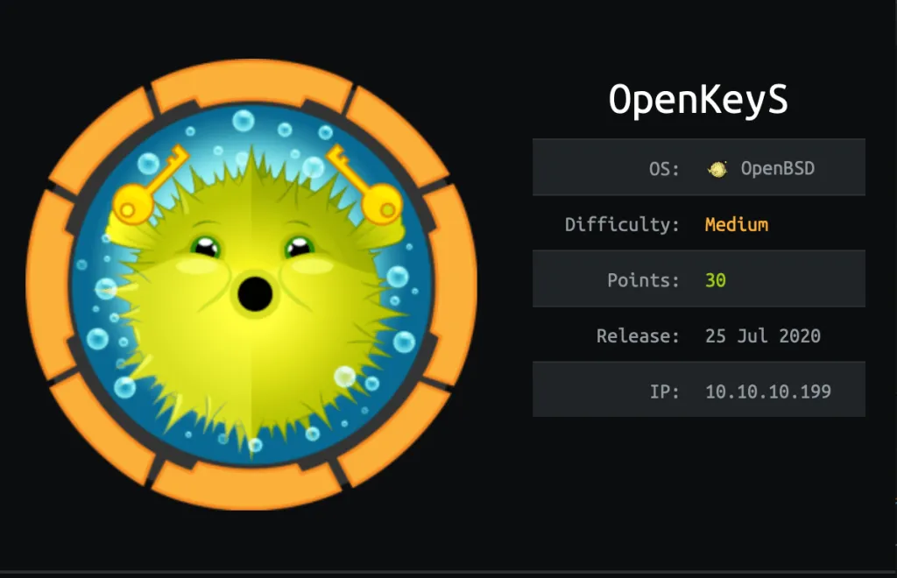
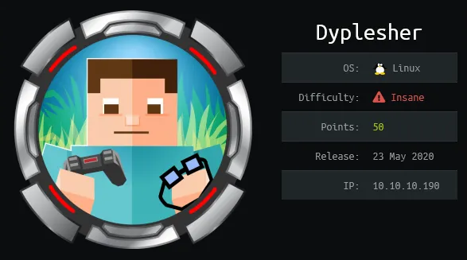
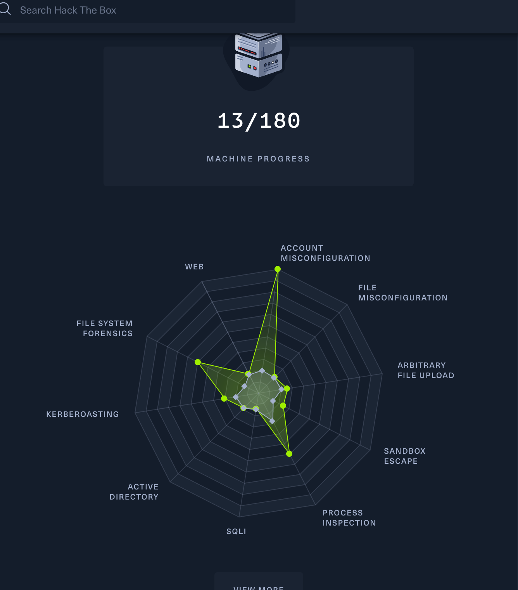
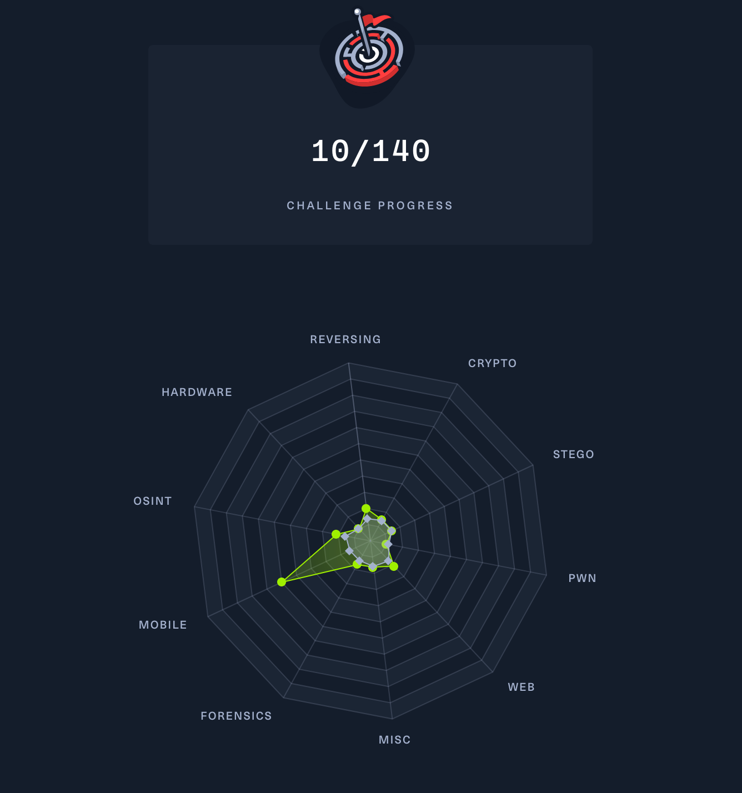
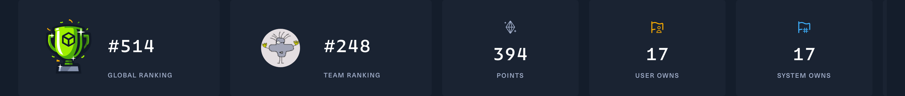

# Hack The Box

You can find my htb profile [here](https://app.hackthebox.eu/profile/268216) and our team [here](https://www.hackthebox.eu/teams/profile/3155)

## Writeups

I have made some writeups of hackthebox (Linux and Windows).

## [Linux machine writeup](https://www.merlijnvermeer.nl/writeups/merlijnvermeerhtblinux.pdf){: style="float: left; width: 50%"}

## [Windows machine writeup](https://www.merlijnvermeer.nl/writeups/merlijnvermeerhtbwindows.pdf){: style="float: right; width: 50%; margin-top: -4px;"}

{: width="50%" style="float: left;"}

{: width="50%" style="float: right;"}

I also made some writeups that describes the exploit more in depth.
## [openkeys writeup](https://www.merlijnvermeer.nl/writeups/merlijnvermeerhtbopenkeys.pdf){: style="float: left; width: 50%"}

## [Windows machine writeup](https://www.merlijnvermeer.nl/writeups/merlijnvermeerhtbdyplesher.pdf){: style="float: right; width: 50%;"}

{: width="50%" style="float: left;"}

{: width="50%" style="float: right;"}

For the password for the writeups check canvas.

TODO openkeys writeup and dyplesher writeup with extra explanation.

## Fortress
After having done multiple boxes with different difficulties I also wanted to try fortress as a challenge. This is a machine made by a company with multiple flags and not only user and root flags.

## Challenges

## Progress
{: width="50%" style="float: left;"}
{: width="50%" style="float: right;"}

## Achievements
I have begon this semester with no hackthebox experience I only created a account before but never did something with it (I already regret that). But since then I learned a lot of real life hacking scenarios and  how to tackle them. I have done alot of boxes easy hard and even insane I also tried fortress.

I have come in the top of Netherland user ranking of Hack the Box. I am currently nr 31/691 of and I am planning to get even higher.
I am rank 609 of the global ranking.
