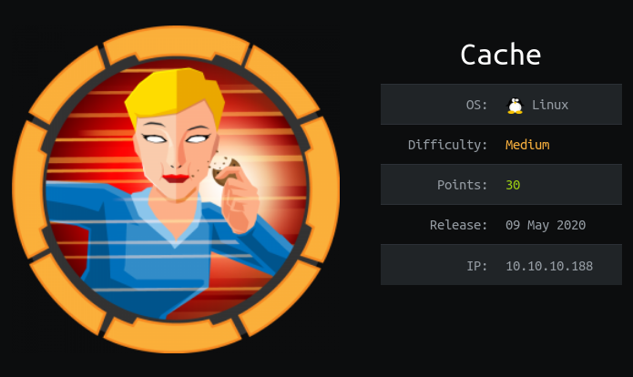
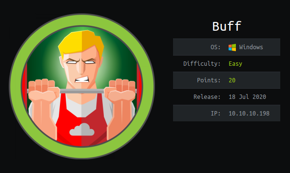

# Hack The Box

You can find my htb profile [here](https://app.hackthebox.eu/profile/268216) and our team [here](https://www.hackthebox.eu/teams/profile/3155)

## Writeups

I have made some writeups of hackthebox (Linux and Windows).

## [Linux machine writeup](https://www.merlijnvermeer.nl/writeups/merlijnvermeerhtblinux.pdf){: style="float: left; width: 50%"}

## [Windows machine writeup](https://www.merlijnvermeer.nl/writeups/merlijnvermeerhtbwindows.pdf){: style="float: right; width: 50%; margin-top: -4px;"}

{: width="50%" style="float: left;"}

{: width="50%" style="float: right;"}

For the password for the writeups check canvas.

## Fortress
After having done multiple boxes with different difficulties I also wanted to try fortress as a challenge. This is a machine made by a company with multiple flags and not only user and root flags.

## Challenges

## Progress

