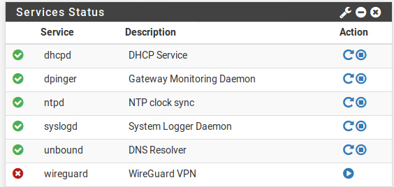
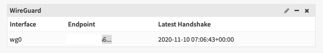
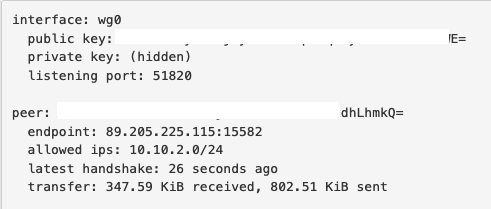

# Lab

I have a homelab at home where I run my virual machines such as my development server.
Before this semester this was running a setup where all the severs where accessible from my home network devices and vice versa.
But this isn't really secure because when a hacker can compromise one of my servers they have full access to my home network.
I wanted to fix this.

## Plan

I want to create a second network on my esxi server which is not connected directly to my home network.
I will add a firewall which will be connected to my home network and also the lab network.
This firewall will get a dmz from the home network router.
I also want to add a ids to detect when there is an intruder on the network.

## Firewall

### pfSense
At first I just installed pfSense because I already have some experience with it because of CSa and CSb.
I started setting everything up added rules which prevented communication between my lan and wan network except my pihole.
I also tried to setup a vpn for remote access.
But after tinkering around I found out pfSense only supported openvpn.
I have multiple wireguard servers which I use.
So I wanted to use wireguard on my firewall.
I found packages to install this on pfSense.

But after trying to get it to work which failed I found OPNSense which included wireguard and also has some other nice extra features.

### OPNSense

I have set up my OPNsense by using the iso from their site.
The setup is almost exactly the same as pfSense because OPNsense is a fork of pfSense.
Firstly I wanted to try and get the wireguard to work because that's the biggest reason to switching to OPNsense.
At first I tried but the service didn't want to start after some time I found out I was doing something wrong with my ip's.
So I deleted everything of wireguard and started again from scratch.
I set up the server and then generated a peer on my phone. After that I added the peer settings to my OPNsense.
I started the wireguard server and it was running!
I added all the needed rules.

After adding those rules I configured my peer to connect to the public ip of my home router and added a port forward to the homelab firewall(After all is working this will be the dmz instead of port forwards).
After configuring everything I turned on my phones data and connected to the vpn.
I tried to communicate with the kali that was running inside the firewall lan network and it worked!
I have a connection and it also shows up in the interfaces.

