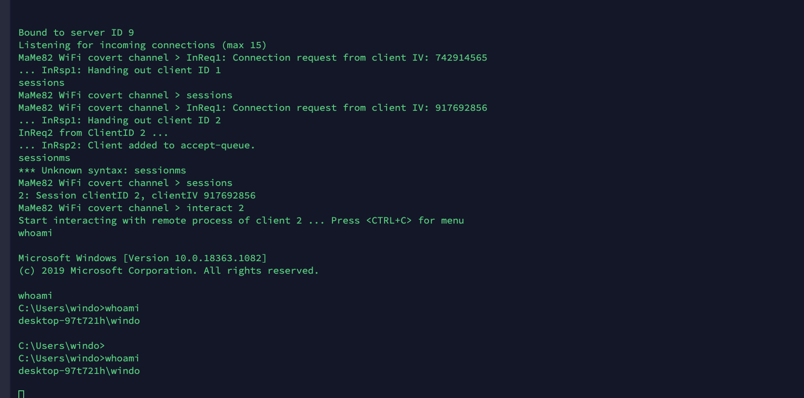

{: width="400px" align="right"}
# P4wnp1
P4wnP1 A.L.O.A. by MaMe82 is a framework which turns a Rapsberry Pi Zero W into a flexible, low-cost platform for pentesting, red teaming and physical engagements ... or into "A Little Offensive Appliance".

## Payloads
For the payloads of the p4wnp1 you can check my (and Rick Theeuwes) [github repository](https://github.com/Riqky/Payloads).

## Lecture

## Dropbox

## Covert channel
As an extra challenge I wanted to use covert shell to create a shell and interact with it even when the pc is not connnected to any internet connection.

I made a script that runs a covert shell by connecting the pc to the p4wnp1 this process keeps connecting receiving and sending data and after that deleting all the evidence and connection. In the next image you see the powershell that can  be easily hidden but is showing for testing purposes. The connection with the p4wnp1 is slow but not tracable. The p4wnp1 creates an screen session which I can open and interact with when I am connected to the p4wnp1 this can also be done with an vpn connection to the p4wnp1. The p4wnp1 only needs to be in range of the target to keep the covert channel connected.

{: width="63%"}
{: width="37%"}
