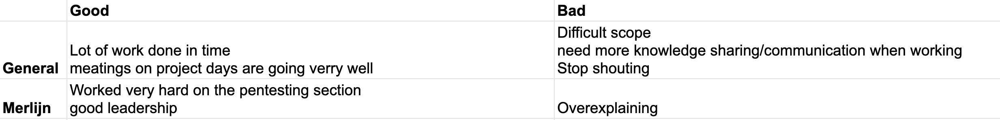

# peer reviews

at the end of each sprint, we look back as a group on the performance of our members. on this page I am going to show the feedback of my fellow students per sprint and write a short article about it.

## sprint 0

I agree with the general feedback, we need to do a little more knowledge sharing as a group and we have a number of people with strong opinions who can shout a bit harder then the rest. I myself am one of these people and will therefore work on talking more calmly in the coming sprint and asking more for the opinion of calmer group members.

I am happy that the rest of my group agrees with me being the leader and give me great feedback I can work on.