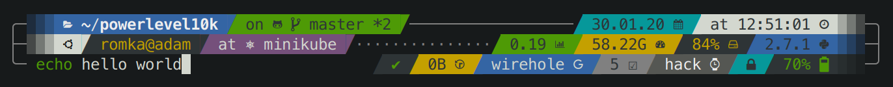
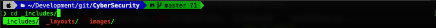
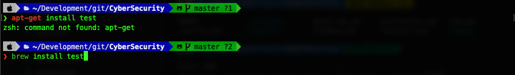
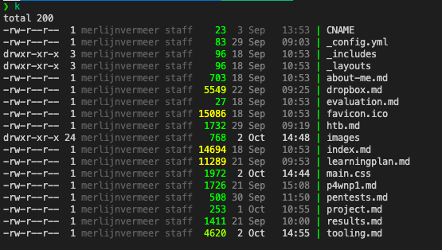
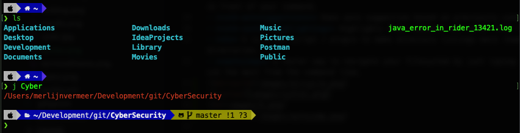
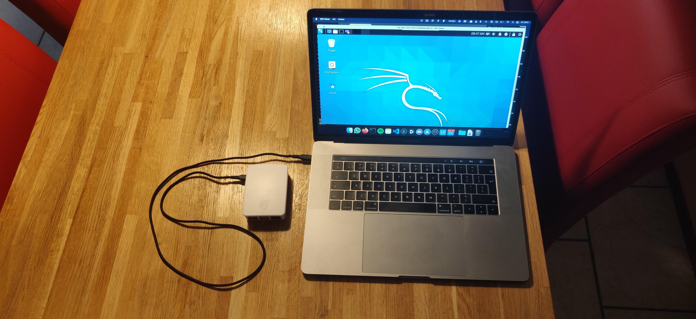

# Tooling
Here I am going to talk about which tooling I used and how I set up / created my hacking environments and tools.

- [Kali](#kali)
  * [Extra tools](#extra-tools)
  * [Terminal (ZSH)](#terminal--zsh-)
    + [Plugins](#plugins)
- [P4wnp1](#p4wnp1)
- [Raspberry pi 4](#raspberry-pi-4)
- [Dropbox](#dropbox)

## Kali
For my main kali / hacking machine, I made a kali VM on my server at home using ESXi just so I can configure everything myself in the VM and therefore use more resources. Furthermore, when I'm working on p4wnp1/dropbox, I can easily create an endpoint for the reverse shell. I have my self-hosted wireguard server running so I always have access to my server, even at school. I also linked the wifi chip in my server to the kali VM so that I can use it for wifi hacking.

### Extra tools
In this environment, I have installed kali full. But I also installed some extra tools that are not included.
- [gobuster](https://github.com/OJ/gobuster). this is a directory and DNS fuzzer that I prefer.
- [evil-winrm](https://github.com/Hackplayers/evil-winrm). The ultimate Windows Remote Management shell for hacking/pentesting
- 

### Terminal (ZSH)
Instead of using bash as terminal I am using zsh.
The Z shell is a Unix shell that can be used as an interactive login shell and as a command interpreter for shell scripting. Zsh is an extended Bourne shell with many improvements.
As addition to ZSH I also installed [oh-my-zsh](https://ohmyz.sh/).
This is a delightful, open source, community-driven framework for managing your Zsh configuration. It comes bundled with thousands of helpful functions, helpers, plugins, themes.
Those plugins and themes can be very usefull and productive.

The theme can give u alot of information. Like this extravagant example below.

Mine doesn't look this extra vagant. I use the [Powerlevel10K theme](https://github.com/romkatv/powerlevel10k). When using things like a git repository I will see info about the repository in that folder with unstaged changes and not pushed commits. This is realy helpful and also works for other things like python.

#### Plugins
I am using multiple plugins that are realy productive and useful:
- **dircycle** When using cd or any other command where you need to select a dir you can cycle trough all the dir's by using tab.
- **safe-paste** When pasing a piece of code all enters will be ignored so that the code wont execute before you want it to.
- **sudo** When u fuck up like everyones do and forget to type sudo before your last command or your current command you can press esc twice to get sudo in front of your command.
- **zsh-autosuggestions** Does auto suggestion based on previously used commands.
- **zsh-syntax-highlighting** Highlights know commands and makes them red if they are not known
- **k** k is a zsh script / plugin to make directory listings more readable, adding a bit of color and some git status information on files and directories.
- **autojump** a faster way to navigate your filesystem by just typing j with the dir name. It works by maintaining a database of the directories you use the most from the command line.
{: width="100%" style="border: 3px solid #2f690a"}
*example dircycle*
{: width="100%" style="border: 3px solid #2f690a"}
*example syntax highlighting*
{: width="100%" style="border: 3px solid #2f690a"}
*example k*
{: width="100%" style="border: 3px solid #2f690a"}
*example autojump*

## P4wnp1
{: width="36%" style="float:right; margin-top: -20px"}

I have a raspberry pi zero w where I 3d printed a case for and on which I run [P4wnp1 aloa](https://github.com/RoganDawes/P4wnP1_aloa) so I can use it as a hid hacking tool but also as a dropbox. I have written several payloads for this that you can read more about below. I also have an explanation of how I made the P4wnp1 function as a dropbox.
[read more](p4wnp1)

## Raspberry pi 4
I also have a mobile kali running on my raspberry pi 4 that I can use if I want to have multiple screens.
Because I have a MacBook pro with those amazing USB c ports I can use the raspberry pi 4 USB c port to connect to it without any internet connection near.
This I accomplish by turning the raspberry pi 4 into a USB c gadget.
The raspberry pi 4 will be powered through the USB c port but also will be having an internet connection over that same port.
This was a little bit of a hassle because some of the needed components changed in the newest Kali Linux iso.
But after some time I got it to work.
I use Termius for the ssh connection and RealVNC for remote desktop control.
This way I can use the raspberry pi without the need of struggling by connecting with a network every place I am.
By using this I have a powerful hacking device on my MacBook Pro that I can also do some wifi hacking on by utilizing the raspberry pi 4 wifi chipset.

## Dropbox
So I use my raspberry pi zero w and my raspberry pi 4 as a dropbox.
But how do I get this to work, what improvements did I add and how do I use this dropbox.
You can read more about this dropbox [here](dropbox).