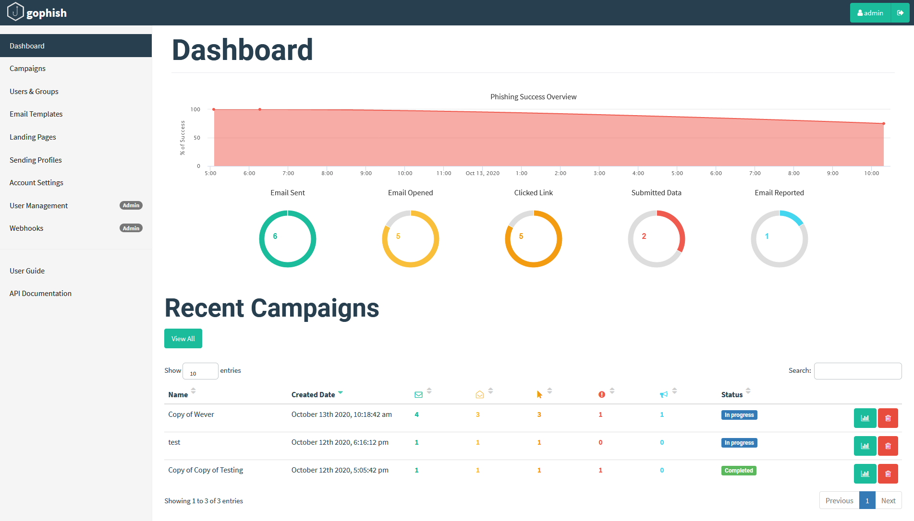

# Wever Pentest

## Testplan

## Phisingtest

### GoPhish
As Phsing framework we have chosen for gophish.
On this framework we can create a campaign with a email template and a landing page.
These we can make ourselfs or import from a existing site.
The campaigns can be planned and you get a clear overview of all the results.

### Mail

### Landing Page

### SMTP Server

### Findings

## External application

The external application we are still waiting for approval.