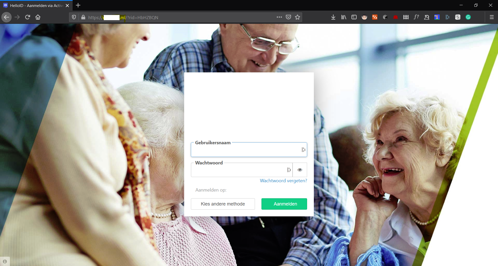

# Wever Pentest
Together with a classmate of mine we tought it would be really interesting to do a pentest for a company.
We got in contact with De Wever and had a conversation on what we could pentest. At the end of the meeting we had 2 things in our scope:
- A phising test
- A external application test

## Testplan
We have set up a testplan got some feedback from the client and after that finalized it.

## Phisingtest
We hebben dus de opdracht om een phising test te doen op de wever. Eerst was de scope hiervoor de hele organtisatie maar vanwege de lastige tijd met corona hebben we gekozen om 50% hiervan te doen.
De phising test heeft als insteek een password reset waarbij ze naar hun "eigen portal" worden gestuurd en daar moeten inloggen.

### GoPhish
As Phsing framework we have chosen for gophish.
On this framework we can create a campaign with a email template and a landing page.
These we can make ourselfs or import from a existing site.
The campaigns can be planned and you get a clear overview of all the results.

### Mail

### Landing Page

### SMTP Server

### Findings

## External application

The external application we are still waiting for approval.