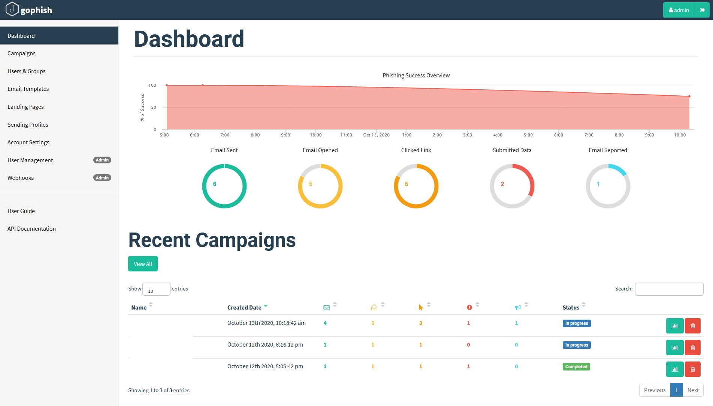
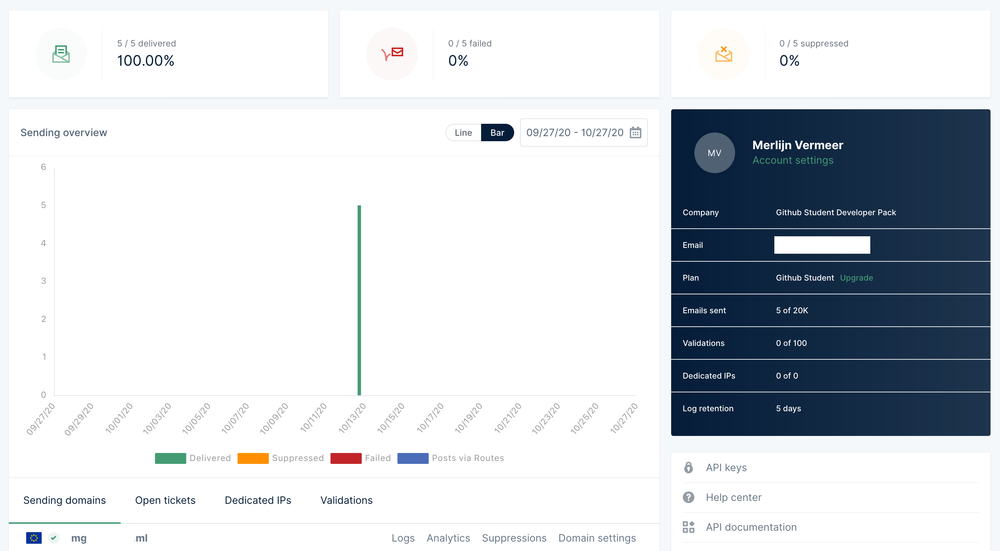

# Wever Pentest
Together with a classmate of mine we tought it would be really interesting to do a pentest for a company.
We got in contact with De Wever and had a conversation on what we could pentest. At the end of the meeting we had 2 things in our scope:
- A phising test
- A external application test

## Testplan
We have set up a testplan got some feedback from the client and after that finalized it.

## Phisingtest
We got the objective to do a phising test on de Wever. At first the scope for this test was the full organisation but because of the difucult times because of corona we have decided to do 50% of the organisation.
The phising test has as idea a password reset where the get send to their "own portal" where they have to login to reset their password.

### GoPhish
As Phsing framework we have chosen for gophish.
On this framework we can create a campaign with a email template and a landing page.
These we can make ourselfs or import from a existing site.
The campaigns can be planned and you get a clear overview of all the results.

### Mail
The mail still needs some working on it.

### Landing Page
For the landing page we looked for a portal or something of dewever quickly we found a employee portal which is perfect.
We just imported the portal using the url and when we use it in our campaign you don't see anything.
But notice the dewever.ml at the top which could be seen by the victim.
We also added a free generated ssl certificate which is making the portal more trustworthy.
When people fill in their info and click aanmelden they will be redirected to the real login page.
And we will get that info without password in our campaign.

### SMTP Server
As smtp server we first tried to use postfix this worked but some of the emails went into spam. This was mostly on office 365 outlook which de wever is also using.
To fix this we tried to get a real smtp server. We have used mailgun for a project we did last semester and know this could be a great solution.
We added the needed dns records and configured the smtp.
This way as far as we know for now all the emails ended up in the inbox instead of spam.
We can send 20K emails which is more then enough.

### Findings
Findings will be shared after the campaign in november/december.

## External application
The external application we are still waiting for approval.